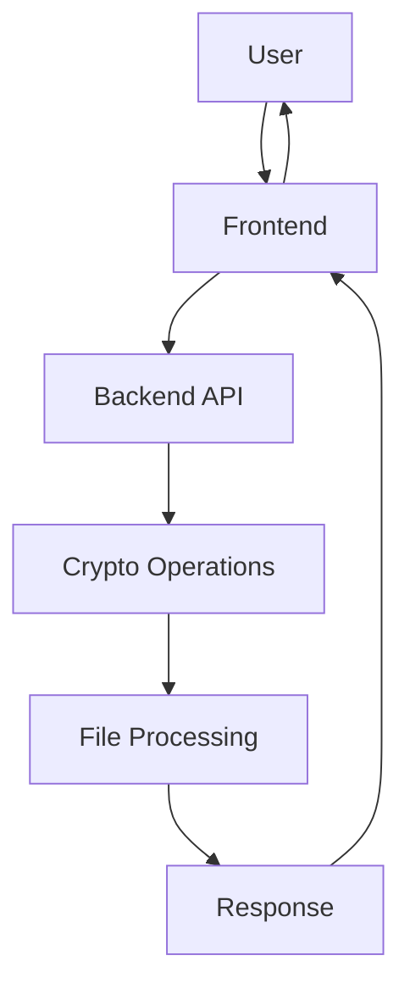

# Cryptography Web Application Documentation

## Table of Contents

1. [Introduction](#introduction)
2. [System Architecture](#system-architecture)
3. [Encryption Algorithms](#encryption-algorithms)
4. [API Reference](#api-reference)
5. [Frontend Implementation](#frontend-implementation)
6. [Backend Implementation](#backend-implementation)
7. [Security Considerations](#security-considerations)
8. [Testing](#testing)
9. [Deployment](#deployment)
10. [Troubleshooting](#troubleshooting)
11. [Development Guide](#development-guide)
12. [Performance Optimization](#performance-optimization)
13. [Contributing Guidelines](#contributing-guidelines)
14. [FAQ](#faq)

## Introduction

The Cryptography Web Application is a full-stack web application that provides various cryptographic operations through a user-friendly interface. It supports multiple encryption algorithms and allows both text and file encryption/decryption operations.

### Purpose

- Provide a secure and easy-to-use interface for cryptographic operations
- Support multiple encryption algorithms for different use cases
- Enable both text and file encryption/decryption
- Offer comprehensive API documentation through Swagger
- Serve as an educational tool for learning cryptography

### Target Audience

- Developers looking to integrate cryptographic operations
- Security professionals needing quick encryption tools
- Students learning about cryptography
- General users requiring secure file encryption
- Researchers studying encryption algorithms

### Project Goals

- Implement industry-standard encryption algorithms
- Provide a user-friendly interface
- Ensure high performance and security
- Support educational use cases
- Maintain code quality and documentation

## System Architecture

### Overview

The application follows a client-server architecture with:

- Frontend: React-based web application
- Backend: Node.js/Express REST API
- Database: No database required (stateless operations)

### Technology Stack

- **Frontend**:

  - React.js (v18+)
  - Material-UI (v5+)
  - Axios for API calls
  - React Router v6
  - React Testing Library
  - Jest for testing

- **Backend**:
  - Node.js (v14+)
  - Express.js (v4+)
  - CryptoJS for cryptographic operations
  - Multer for file handling
  - Swagger for API documentation
  - Jest for testing

### System Diagram



### Data Flow

1. User input (text/file) → Frontend validation
2. Frontend → Backend API request
3. Backend processing → Cryptographic operation
4. Backend → Frontend response
5. Frontend → User output

## Encryption Algorithms

### AES (Advanced Encryption Standard)

- **Implementation**: 128-bit ECB mode
- **Key Requirements**: 16-character key
- **Use Cases**: Secure text and file encryption
- **API Endpoints**:
  - `/encrypt/aes`
  - `/decrypt/aes`
  - `/encrypt-file/aes`
  - `/decrypt-file/aes`

Example Implementation:

```javascript
// AES Encryption
const ciphertext = CryptoJS.AES.encrypt(plaintext, key).toString();

// AES Decryption
const bytes = CryptoJS.AES.decrypt(ciphertext, key);
const plaintext = bytes.toString(CryptoJS.enc.Utf8);
```

### DES (Data Encryption Standard)

- **Implementation**: TripleDES
- **Key Requirements**: 24-character key
- **Use Cases**: Legacy system compatibility
- **API Endpoints**:
  - `/encrypt/des`
  - `/decrypt/des`
  - `/encrypt-file/des`
  - `/decrypt-file/des`

Example Implementation:

```javascript
// DES Encryption
const ciphertext = CryptoJS.TripleDES.encrypt(plaintext, key).toString();

// DES Decryption
const bytes = CryptoJS.TripleDES.decrypt(ciphertext, key);
const plaintext = bytes.toString(CryptoJS.enc.Utf8);
```

### Caesar Cipher

- **Implementation**: Shift cipher
- **Key Requirements**: Numeric shift value
- **Use Cases**: Educational purposes
- **API Endpoints**:
  - `/encrypt/caesar`
  - `/decrypt/caesar`

Example Implementation:

```javascript
function caesarShift(text, shift, decrypt = false) {
  if (decrypt) shift = (26 - shift) % 26;
  return text.replace(/[a-z]/gi, (char) => {
    const base = char <= "Z" ? 65 : 97;
    return String.fromCharCode(
      ((char.charCodeAt(0) - base + shift) % 26) + base
    );
  });
}
```

### Vigenere Cipher

- **Implementation**: Poly-alphabetic substitution
- **Key Requirements**: Alphabetic key
- **Use Cases**: Historical encryption
- **API Endpoints**:
  - `/encrypt/vigenere`
  - `/decrypt/vigenere`
  - `/encrypt-file/vigenere`
  - `/decrypt-file/vigenere`

Example Implementation:

```javascript
function vigenereBuffer(buffer, key, decrypt = false) {
  const output = Buffer.alloc(buffer.length);
  for (let i = 0; i < buffer.length; i++) {
    const k = key[i % key.length].toLowerCase().charCodeAt(0) - 97;
    output[i] = decrypt ? (buffer[i] - k + 256) % 256 : (buffer[i] + k) % 256;
  }
  return output;
}
```

### Vernam Cipher

- **Implementation**: XOR-based encryption
- **Key Requirements**: Key length matches file size
- **Use Cases**: Secure file encryption
- **API Endpoints**:
  - `/encrypt/vernam`
  - `/decrypt/vernam`
  - `/encrypt-file/vernam`
  - `/decrypt-file/vernam`
  - `/generate-vernam-key`

Example Implementation:

```javascript
function xorBuffer(buffer, keyBuffer) {
  const result = Buffer.alloc(buffer.length);
  for (let i = 0; i < buffer.length; i++) {
    result[i] = buffer[i] ^ keyBuffer[i];
  }
  return result;
}
```

### Transposition Cipher

- **Implementation**: Columnar transposition
- **Key Requirements**: Keyword with ≥2 unique characters
- **Use Cases**: Educational purposes
- **API Endpoints**:
  - `/encrypt/transposition`
  - `/decrypt/transposition`
  - `/encrypt-file/transposition`
  - `/decrypt-file/transposition`

Example Implementation:

```javascript
function transposeText(text, key, decrypt = false) {
  const keyChars = key.toUpperCase().split("");
  const keyLength = keyChars.length;
  const charOrder = {};
  const uniqueChars = [...new Set(keyChars)].sort();
  uniqueChars.forEach((char, index) => {
    charOrder[char] = index;
  });
  const columnOrder = keyChars.map((char) => charOrder[char]);
  // ... implementation continues
}
```

## API Reference

### Authentication

- No authentication required (stateless operations)

### Request/Response Format

```json
// Request
{
  "plaintext": "string",
  "key": "string"
}

// Response
{
  "ciphertext": "string"
}
```

### Error Handling

```json
{
  "error": "Error message"
}
```

### Rate Limiting

- No rate limiting implemented (stateless operations)

### API Endpoints

#### Text Encryption/Decryption

```javascript
// AES
POST / encrypt / aes;
POST / decrypt / aes;

// DES
POST / encrypt / des;
POST / decrypt / des;

// Caesar
POST / encrypt / caesar;
POST / decrypt / caesar;

// Vigenere
POST / encrypt / vigenere;
POST / decrypt / vigenere;

// Vernam
POST / encrypt / vernam;
POST / decrypt / vernam;

// Transposition
POST / encrypt / transposition;
POST / decrypt / transposition;
```

#### File Operations

```javascript
// AES
POST / encrypt - file / aes;
POST / decrypt - file / aes;

// DES
POST / encrypt - file / des;
POST / decrypt - file / des;

// Vigenere
POST / encrypt - file / vigenere;
POST / decrypt - file / vigenere;

// Vernam
POST / encrypt - file / vernam;
POST / decrypt - file / vernam;

// Transposition
POST / encrypt - file / transposition;
POST / decrypt - file / transposition;
```

## Frontend Implementation

### Components Structure

```
src/
├── components/
│   ├── CipherSelector/
│   │   ├── CipherSelector.jsx
│   │   └── CipherSelector.css
│   ├── FileUpload/
│   │   ├── FileUpload.jsx
│   │   └── FileUpload.css
│   ├── KeyInput/
│   │   ├── KeyInput.jsx
│   │   └── KeyInput.css
│   ├── ResultDisplay/
│   │   ├── ResultDisplay.jsx
│   │   └── ResultDisplay.css
│   └── common/
│       ├── Button.jsx
│       ├── Input.jsx
│       └── LoadingSpinner.jsx
├── pages/
│   ├── Home/
│   │   ├── Home.jsx
│   │   └── Home.css
│   ├── TextEncryption/
│   │   ├── TextEncryption.jsx
│   │   └── TextEncryption.css
│   └── FileEncryption/
│       ├── FileEncryption.jsx
│       └── FileEncryption.css
├── services/
│   ├── api.js
│   └── encryptionService.js
├── utils/
│   ├── validation.js
│   └── helpers.js
└── App.jsx
```

### Key Features

- Responsive design
- Real-time validation
- File drag-and-drop support
- Progress indicators
- Error handling
- Result preview
- Dark/Light mode
- Mobile-friendly interface

### Component Examples

#### CipherSelector Component

```jsx
import React from "react";
import { Select, MenuItem, FormControl, InputLabel } from "@mui/material";

const CipherSelector = ({ value, onChange }) => {
  const ciphers = [
    { value: "aes", label: "AES" },
    { value: "des", label: "DES" },
    { value: "caesar", label: "Caesar" },
    { value: "vigenere", label: "Vigenere" },
    { value: "vernam", label: "Vernam" },
    { value: "transposition", label: "Transposition" },
  ];

  return (
    <FormControl fullWidth>
      <InputLabel>Select Cipher</InputLabel>
      <Select value={value} onChange={onChange} label="Select Cipher">
        {ciphers.map((cipher) => (
          <MenuItem key={cipher.value} value={cipher.value}>
            {cipher.label}
          </MenuItem>
        ))}
      </Select>
    </FormControl>
  );
};

export default CipherSelector;
```

#### FileUpload Component

```jsx
import React, { useCallback } from "react";
import { useDropzone } from "react-dropzone";

const FileUpload = ({ onFileSelect }) => {
  const onDrop = useCallback(
    (acceptedFiles) => {
      if (acceptedFiles.length > 0) {
        onFileSelect(acceptedFiles[0]);
      }
    },
    [onFileSelect]
  );

  const { getRootProps, getInputProps, isDragActive } = useDropzone({
    onDrop,
    maxSize: 100 * 1024 * 1024, // 100MB
  });

  return (
    <div {...getRootProps()} className="file-upload">
      <input {...getInputProps()} />
      {isDragActive ? (
        <p>Drop the file here...</p>
      ) : (
        <p>Drag and drop a file, or click to select</p>
      )}
    </div>
  );
};

export default FileUpload;
```

## Backend Implementation

### Server Configuration

```javascript
const express = require("express");
const cors = require("cors");
const multer = require("multer");
const swaggerDocs = require("./swagger");

const app = express();
const port = process.env.PORT || 5000;

// Middleware
app.use(
  cors({
    exposedHeaders: ["Content-Disposition"],
  })
);
app.use(express.json());
app.use(express.urlencoded({ extended: true }));

// File upload configuration
const storage = multer.memoryStorage();
const upload = multer({
  storage: storage,
  limits: {
    fileSize: 100 * 1024 * 1024, // 100MB
    fieldSize: 100 * 1024 * 1024, // 100MB
  },
});

// Routes
app.use("/api", require("./routes"));

// Swagger documentation
swaggerDocs(app);

// Error handling
app.use((err, req, res, next) => {
  console.error(err.stack);
  res.status(500).json({ error: "Something went wrong!" });
});

// Start server
app.listen(port, () => {
  console.log(`Server running at http://localhost:${port}`);
});
```

### File Handling

- Multer configuration for file uploads
- 100MB file size limit
- Memory storage for processing
- Secure file download headers

### Error Handling

- Global error middleware
- Input validation
- File type checking
- Key validation

## Security Considerations

### Input Validation

- Frontend validation
- Backend validation
- File type checking
- Key length verification

### File Security

- Secure file upload
- Memory-only processing
- No file storage
- Secure download headers

### Key Management

- Client-side key generation
- No key storage
- Key length requirements
- Key format validation

## Testing

### Backend Testing

- Jest test framework
- Unit tests for each cipher
- File handling tests
- Error handling tests

Example Test:

```javascript
describe("AES Encryption", () => {
  test("should encrypt text correctly", () => {
    const plaintext = "Hello World";
    const key = "1234567890123456";
    const result = encryptAES(plaintext, key);
    expect(result).toBeDefined();
    expect(result).not.toBe(plaintext);
  });
});
```

### Frontend Testing

- React Testing Library
- Component tests
- API integration tests
- UI interaction tests

Example Test:

```javascript
import { render, screen, fireEvent } from "@testing-library/react";
import CipherSelector from "./CipherSelector";

describe("CipherSelector", () => {
  test("should render all cipher options", () => {
    render(<CipherSelector value="aes" onChange={() => {}} />);
    expect(screen.getByText("AES")).toBeInTheDocument();
    expect(screen.getByText("DES")).toBeInTheDocument();
    expect(screen.getByText("Caesar")).toBeInTheDocument();
  });
});
```

## Deployment

### Prerequisites

- Node.js v14+
- npm v6+
- Modern web browser

### Environment Setup

1. Clone repository
2. Install dependencies
3. Configure environment variables
4. Start servers

### Production Deployment

1. Build frontend
2. Configure production environment
3. Set up reverse proxy (optional)
4. Enable HTTPS (recommended)

## Troubleshooting

### Common Issues

1. **File Upload Fails**

   - Check file size limit
   - Verify file type
   - Check network connection

2. **Encryption/Decryption Errors**

   - Verify key format
   - Check key length
   - Validate input data

3. **API Connection Issues**
   - Verify server status
   - Check CORS settings
   - Validate API endpoints

### Debugging

- Enable debug logging
- Check server logs
- Verify network requests
- Test individual components

## Development Guide

### Setting Up Development Environment

1. Install Node.js and npm
2. Clone the repository
3. Install dependencies
4. Configure environment variables
5. Start development servers

### Code Style Guide

- Follow ESLint configuration
- Use Prettier for formatting
- Write meaningful commit messages
- Document new features

### Git Workflow

1. Create feature branch
2. Make changes
3. Run tests
4. Create pull request
5. Code review
6. Merge to main

## Performance Optimization

### Frontend Optimization

- Code splitting
- Lazy loading
- Image optimization
- Caching strategies

### Backend Optimization

- Request compression
- Response caching
- Connection pooling
- Memory management

## Contributing Guidelines

### Code of Conduct

- Be respectful
- Follow coding standards
- Write tests
- Document changes

### Pull Request Process

1. Fork the repository
2. Create feature branch
3. Make changes
4. Run tests
5. Submit PR
6. Address feedback

## FAQ

### General Questions

1. **What is the maximum file size?**

   - 100MB for both upload and download

2. **Which browsers are supported?**

   - Chrome, Firefox, Safari, Edge (latest versions)

3. **Is the application secure?**

   - Yes, all operations are performed in memory
   - No data is stored permanently

### Technical Questions

1. **How are files processed?**

   - Files are processed in memory
   - No permanent storage
   - Secure download headers

2. **What encryption algorithms are supported?**

   - AES, DES, Caesar, Vigenere, Vernam, Transposition

3. **How are keys managed?**

   - Keys are generated client-side
   - No key storage
   - Key length validation

## Support

For issues and feature requests:

1. Check existing issues
2. Create new issue
3. Provide detailed information
4. Include error logs if applicable

## License

This project is licensed under the MIT License. See LICENSE file for details.

## Acknowledgments

- Node.js and Express team
- React team
- CryptoJS contributors
- Swagger team
- Material-UI team
- All contributors and maintainers
